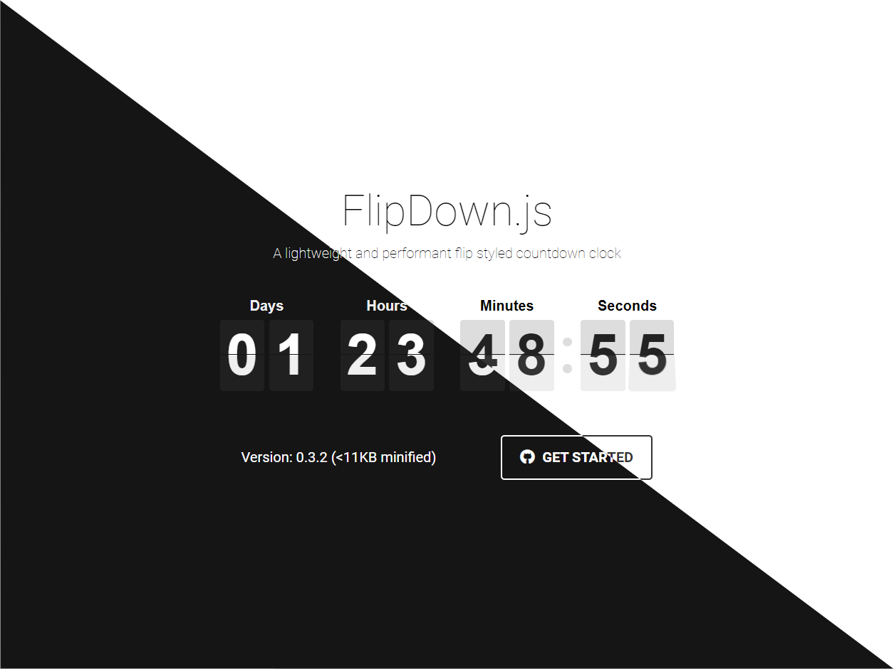

## FlipDown

A lightweight and performant flip styled countdown clock.

  

## Usage

### Basic usage

```typescript jsx
import React from 'react'
import {Flipdown} from "react-flipdown";

// Unix timestamp (in seconds) to count down to
const twoDaysFromNow = (new Date().getTime() / 1000) + (86400 * 2) + 1;

function App() {
    return (
        <Flipdown epoch={twoDaysFromNow}/>
    )
}
```

## Properties

| Name           | Type    | Required | Default | Description                                                                                                   |
|----------------|---------|----------|---------|---------------------------------------------------------------------------------------------------------------|
| showLabels     | boolean | no       | true    | Set it to false if you don't want to show the labels.                                                         |
| showSeparators | boolean | no       | true    | Set it to false if you don't want to show the separators (colon) between time unit.                           |
| labels         | Object  | no       | true    | Custom object with the labels used to represent information for each section (days, hours, minutes, seconds). |


### Use of label properties

```typescript jsx
import React, {useMemo} from 'react'
import {Flipdown} from "react-flipdown";

// Unix timestamp (in seconds) to count down to
const twoDaysFromNow = (new Date().getTime() / 1000) + (86400 * 2) + 1;

function App() {
    const labels = useMemo(() => ({
        days: 'Días',
        hours: 'Horas',
        minutes: 'Minutos',
        seconds: 'Segundos',
    }), [])
    
    return (
        <Flipdown
            epoch={twoDaysFromNow}
            labels={labels}
        />
    )
}
```

###### Mock Design and Code Original by [Peter Butcher](https://github.com/PButcher/flipdown)

## Monorepo with Tubo

This repository uses [Turbo](https://turbo.build/) to manage the monorepo structure efficiently.
Turbo helps in task running, caching, and optimizing the build process.

## Getting Started

### Prerequisites

Make sure you have the following installed:

- [Bun](https://bun.sh/) (version 1.39 or later)

### Installation

1. Clone the repository:

 ```sh
 git clone https://github.com/Andres6936/FlipDown.git
 cd FlipDown
 ```

2. Install the dependencies using Bun:

```sh
bun install
```

### Project Structure

The project follows a monorepo structure managed by Turbo. Below is an overview of the directory structure:

```
FlipDown/
├── showcase/            # Contain the showcase application
├── packages/            # Contains shared packages
│   └── react-flipdown/  # Contain the code of React library
├── turbo.json           # Turbo configuration file
└── package.json         # Root package.json file
```

### Contributing

We welcome contributions to improve FlipDown. If you have any suggestions or find any issues, please open an issue or a pull request.

1. Fork the repository
2. Create a new branch (git checkout -b feature/new-feature)
3. Commit your changes (git commit -m 'Add new feature')
4. Push to the branch (git push origin feature/new-feature)
5. Open a pull request

### License

This project is licensed under the MIT License - see the [LICENSE](./License.md) file for details.
